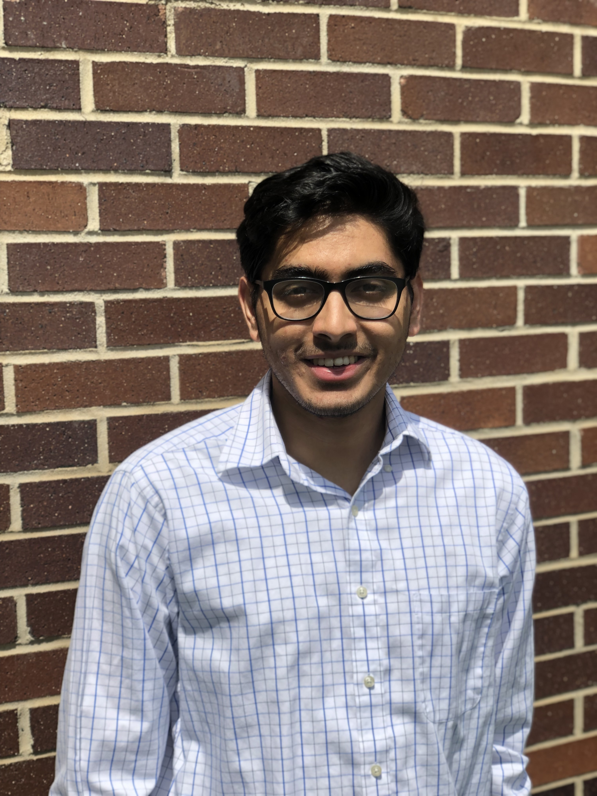

# Georgia Tech

## Personal Website

Hi there! I am a 2nd year MS Aerospace Engineering student at the Georgia Institute of Technology. I'm a graduate researcher at the [Aerospace Systems Design Lab](http://www.asdl.gatech.edu/Research_Areas.html) working on harnessing data-driven insights to interesting and vogue aviation/transportation problems. My main areas of research are in Operations Research, Urban Air Mobility Concepts, and Network Planning.

Happy to have a conversation at : <nvenkatesh6@gatech.edu>
